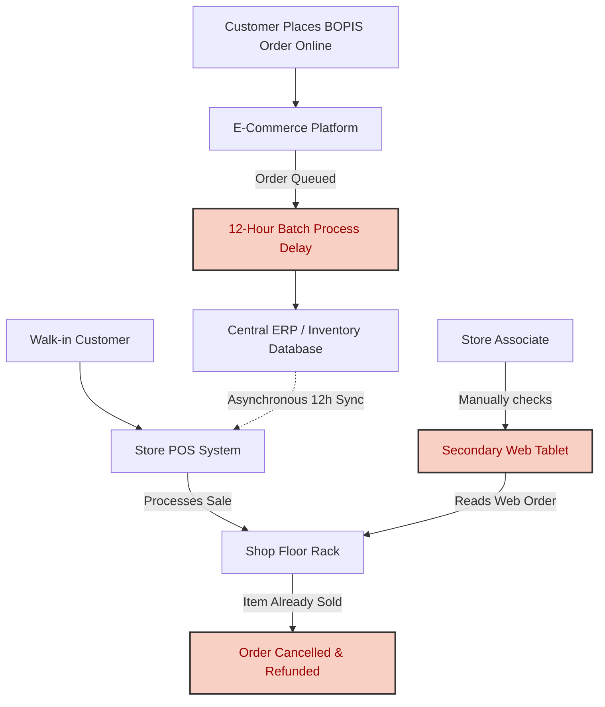
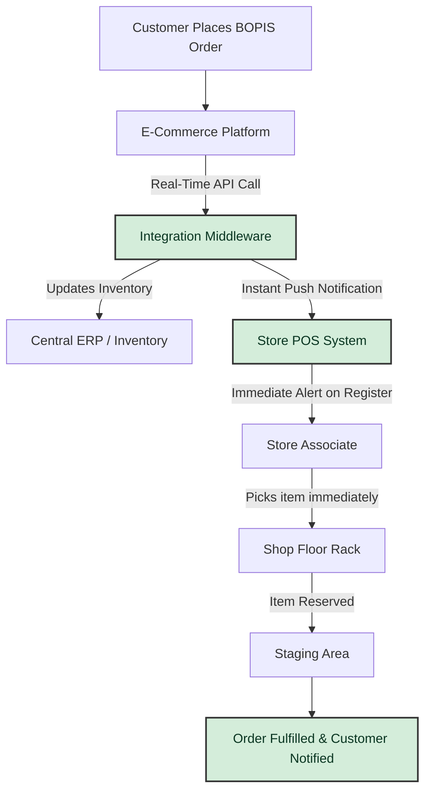

```mermaid
graph TD
    Customer[Customer Places BOPIS Order Online] --> Ecom[E-Commerce Platform]
    Ecom -->|Order Queued| Batch[12-Hour Batch Process Delay]
    Batch --> ERP[Central ERP / Inventory Database]
    WalkIn[Walk-in Customer] --> POS[Store POS System]
    POS -->|Processes Sale| Floor[Shop Floor Rack]
    Staff[Store Associate] -->|Manually checks| Tablet[Secondary Web Tablet]
    Tablet -->|Reads Web Order| Floor
    Floor -->|Item Already Sold| Cancel[Order Cancelled & Refunded]
    ERP -.->|Asynchronous 12h Sync| POS
    style Batch fill:#f9d0c4,stroke:#333,stroke-width:2px,color:#900
    style Tablet fill:#f9d0c4,stroke:#333,stroke-width:2px,color:#900
    style Cancel fill:#f9d0c4,stroke:#333,stroke-width:2px,color:#900
```

```mermaid
graph TD
    Customer[Customer Places BOPIS Order] --> Ecom[E-Commerce Platform]
    Ecom -->|Real-Time API Call| Middle[Integration Middleware]
    Middle -->|Updates Inventory| ERP[Central ERP / Inventory]
    Middle -->|Instant Push Notification| POS[Store POS System]
    POS -->|Immediate Alert on Register| Staff[Store Associate]
    Staff -->|Picks item immediately| Floor[Shop Floor Rack]
    Floor -->|Item Reserved| Stage[Staging Area]
    Stage --> Success[Order Fulfilled & Customer Notified]
    style Middle fill:#d4edda,stroke:#333,stroke-width:2px,color:#0a3622
    style POS fill:#d4edda,stroke:#333,stroke-width:2px,color:#0a3622
    style Success fill:#d4edda,stroke:#333,stroke-width:2px,color:#0a3622
```
